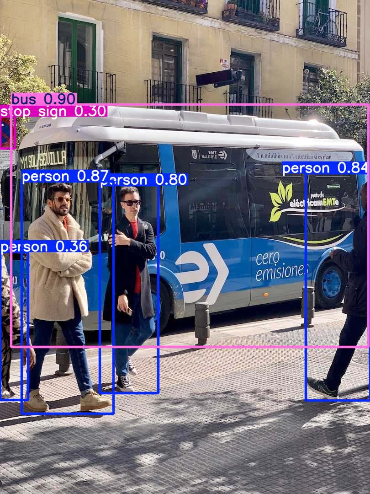

# 🎯 Object Detection with YOLOv8n (Nano Version)

This project showcases a **lightweight and fast object detection** pipeline using **YOLOv8n** — the smallest version of the Ultralytics YOLO family. It's ideal for **real-time applications**, experimentation, and learning purposes with small datasets like `coco128`.

---

## ✨ Features

- ✅ Based on **YOLOv8n** — "n" stands for **Nano** (smallest, fastest model)
- ⚡ Fast training and inference on low-resource machines
- 🗂️ Uses `coco128`, a small dataset subset for quick demo
- 📦 Built with [Ultralytics YOLO](https://github.com/ultralytics/ultralytics)
- 📈 Produces visual outputs (bounding boxes, metrics, logs)

---

## 🧠 What is YOLOv8n?

YOLOv8n is the nano version of YOLOv8:  
✅ Smallest model in the YOLOv8 family  
✅ Designed for **speed and low-latency inference**  
✅ Ideal for mobile, embedded, and edge devices

---

## 📁 Dataset

This example uses the [coco128](https://github.com/ultralytics/ultralytics/blob/main/ultralytics/datasets/coco128.yaml) dataset — a mini version of MS COCO for testing and demos.

---

## 🔧 Requirements

Install dependencies:

```bash
pip install ultralytics
````

---

## 🚀 How It Works

### 1. Load the Model

```python
from ultralytics import YOLO
model = YOLO('yolov8n.pt')  # Nano version
```

### 2. Train the Model

```python
results = model.train(data='coco128.yaml', epochs=5, imgsz=640)
```

### 3. Run Inference

```python
results = model.predict(source='bus.jpg', conf=0.25)
for r in results:
    r.show()  # Display result
```

---

## 🖼️ Output Example

> Sample prediction on `bus.jpg` using YOLOv8n:

 <!-- Optional image if saved -->

---

## 📊 Result Directory

After training and prediction, results and logs are stored in:

```
runs/detect/train/
```

Including:

* Training loss curves
* mAP charts
* Confusion matrix
* Detected image samples

---

## 🧪 Tips

* Want to use your own dataset? Replace `coco128.yaml` with your custom `.yaml` config.
* For even faster runs, lower `epochs` or reduce image resolution with `imgsz`.

---

## 📄 License

This project uses the [Ultralytics YOLO License](https://github.com/ultralytics/ultralytics/blob/main/LICENSE).

---

